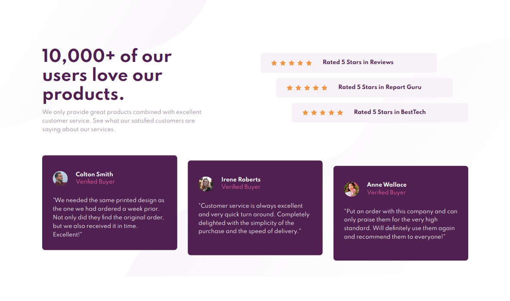

# Frontend Mentor - Social proof section solution

This is a solution to the [Social proof section challenge on Frontend Mentor](https://www.frontendmentor.io/challenges/social-proof-section-6e0qTv_bA). Frontend Mentor challenges help you improve your coding skills by building realistic projects.

## Table of contents

- [Overview](#overview)
  - [The challenge](#the-challenge)
  - [Screenshot](#screenshot)
  - [Links](#links)
- [My process](#my-process)
  - [Built with](#built-with)
  - [What I learned](#what-i-learned)
- [Author](#author)

## Overview

### The challenge

Users should be able to:

- View the optimal layout for the section depending on their device's screen size

### Screenshot

### Links

- Solution URL: [GitHub]()
- Live Site URL: [GitHub Pages]()

## My process

As usual - I derived the proper markup first, that's both semantic and provides the necessary styling hooks.
After that - saving the necessary properties from the style guide (mostly theme colors) and then - themobile layout using top-down approach - deriving the major layout and the details afterwards - mostly using column _flex_ (and a little _grid_ for card headers).
Afterwards I did the desktop layout using _grid_ for major component layout and stayed mostly with
_flex_ for the individual parts.

### Built with

- Semantic HTML5 markup
- CSS custom properties
- Flexbox
- CSS Grid
- Mobile-first workflow

### What I learned

There can be multiple ways to do a layout and sometimes there isn't a specific indicator for one specific solution. Sometimes a preferable solution pops out later during the project - that's why writing modular and well organized CSS matters - it's more readable and makes it easier to refactor later.

## Author

- Frontend Mentor - [@marisudris](https://www.frontendmentor.io/profile/marisudris)
- GitHub - [@marisudris](https://www.github.com/marisudris)
